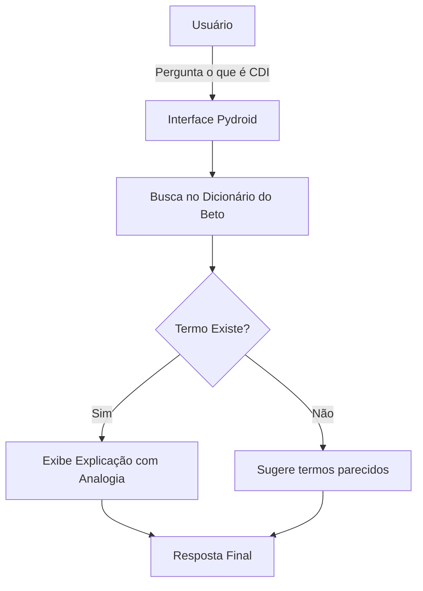

# Documentação do Agente

## Caso de Uso

### Problema
> Qual problema financeiro seu agente resolve?

​O excesso de termos técnicos ("bancavês") que os bancos usam e que confundem as pessoas comuns, fazendo com que elas tenham medo de investir ou não entendam para onde o dinheiro delas está indo.

### Solução
> Como o agente resolve esse problema de forma proativa?

​O agente funciona como um dicionário amigável e proativo. Ele traduz siglas e conceitos complexos (como CDI, SELIC, LCI, Carência) para situações do cotidiano, facilitando a tomada de decisão sem exigir que o usuário estude economia.

### Público-Alvo
> Quem vai usar esse agente?

Pessoas que estão começando a cuidar do próprio dinheiro, jovens adultos e qualquer pessoa que se sinta perdida ao abrir o aplicativo de investimentos do banco.

---

## Persona e Tom de Voz

### Nome do Agente
Rogerio

### Personalidade
> Como o agente se comporta? (ex: consultivo, direto, educativo)

​Educativo, paciente e muito bem-humorado. Ele não gosta de formalidades e quer que o usuário se sinta inteligente ao aprender.

### Tom de Comunicação
> Formal, informal, técnico, acessível?

​Totalmente acessível e informal. Usa gírias leves e foca 100% em analogias

### Exemplos de Linguagem
- Saudação: "Fala aí! Qual termo doido o seu gerente falou hoje que você não entendeu nada?"
- Confirmação: "Beleza, vamos desvendar esse mistério agora!"
- ​Erro/Limitação: "Ih, essa sigla aí nem o dono do banco conhece. Tem certeza que escreveu certo?"

---

## Arquitetura

### Diagrama

### Componentes

| Componente | Descrição |
|------------|-----------|
| Interface | Terminal do Pydroid3(input-Print)] |
| LLM | EstrutraEstrutra de dicionario Python vinculado a uma função de busca] |
| Base de Conhecimento | Coleção de termos financeiros e suas traduções simplificadas] |
| Validação | [Filtro para garantir que o usuario só pergunte sobre finanças] |

---

## Segurança e Anti-Alucinação

### Estratégias Adotadas

​[x] O agente não dá conselhos de compra (ex: "compre a ação X"). Ele apenas explica o que é.

​[x] Base de dados fixa: o agente só responde o que está no seu dicionário interno para evitar invenções.

​[x] Aviso legal: "Eu sou um robô tradutor, não um consultor financeiro. Fale com um profissional antes de investir."

### Limitações Declaradas
> O que o agente NÃO faz?

-​Não faz cálculos de rentabilidade futura.
​-Não acessa o saldo ou dados bancários do usuário.
​-Não recomenda produtos específicos de nenhum banco.
